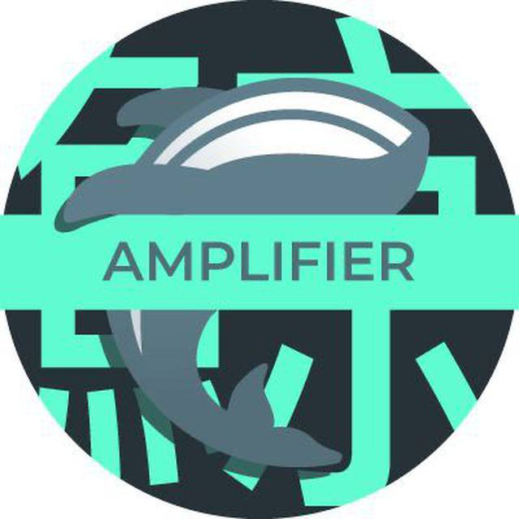

# Kujira Amplifier

The Kujira Amplifier Telegram chat is an outreach focused community building space that spreads Kujira content. 'Kujira Amplifier' amplifies well-researched Kujira ecosystem related threads, catchy memes, and colorful graphics to share and explain the Kujira mission far and wide. The Kujira community's passion is leveraged by the Kujira ecosystem to expand more quickly.&#x20;

<figure><figcaption></figcaption></figure>

High quality community engagement attracts developers, integrations, and partnerships. Related efforts can clear up misinformation, introduce the Kujira message to more people, increase user retention, and attract the interest of content creators, skilled individuals, and protocols / DAOs / chains / ecosystems over time.

Join the amplifier pod of likeminded Kujirans who want to spread the Kujira message today [here](https://t.me/kujiraamplifier) and find a related library of helpful Kujira media assets [here](https://t.me/kujiraamplifierlibrary).  &#x20;

&#x20;
