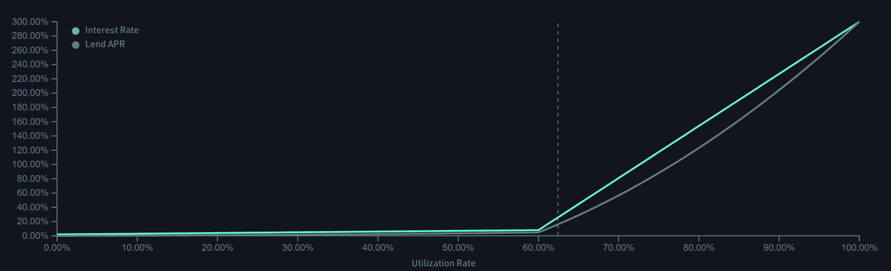

# 📒 Lend

[https://ghost.kujira.app/lend](https://ghost.kujira.app/lend) or [https://ghost.kujira.network/lend](https://ghost.kujira.network/lend)

## Overview

The Lend tab allows users to lend assets on GHOST to earn at a variable rate.&#x20;

This tab contains a table of all existing assets that can be lent on GHOST including basic information about each of these assets such as: asset name, total deposited, amount available to be borrowed, percentage utilization, the current borrow interest rate, the lend APR, and your deposit value. Furthermore, each row contains a 'lend' button and a 'more' button.

The table can be sorted ascending or descending by any of these 7 categories at your own convenience.&#x20;

<figure><figcaption></figcaption></figure>

'Asset Name' is the asset symbol. For example, Wrapped Bitcoin has wBTC as its asset name.

'Total Deposited' is the total amount of an asset lent to GHOST collectively across all lenders.

'Amount available to be borrowed' is the total amount deposited minus the total amount already borrowed by other users.

'Utilization' is the ratio of the amount already borrowed to the total amount deposited. The maximum possible utilization is 100%. Interest rates correlate with the utilization.&#x20;

'Borrow Interest Rate' is the currently yearly interest that borrowers owe on any open positions where they have borrowed that specific asset. Interest accrues continuously over time for as long as a position is open, but is presented on a yearly basis for accessibility.&#x20;

'Lend APR' is the current yearly interest rate that lenders earn on any provided liquidity to GHOST for that asset. Like the 'borrow interest rate', the 'lend APR' varies over time with the utilization. Interest accrues continuously over time.&#x20;

'Your Deposit Value' is the amount of an asset that you've actually deposited into GHOST. If you trade away the xToken receipt for your deposit, you will lose that deposit as the ownership transfers to someone else. &#x20;

By clicking the 'more' button on a particular asset's row, it is possible to see a graph showing the relationship between the utilization, borrow interest rate, and lend APR for that asset. This can be used to predict the evolution of the interest rate or lend APR over time.

For example, below is the corresponding graph for axlUSDC:

<figure><figcaption></figcaption></figure>

## How does Lending work on GHOST

For any asset available to be lent on GHOST, by navigating to that row of the table, and clicking on 'Lend', you can then enter however much you would like of said asset (up to the maximum amount available in your wallet) and click 'Lend ...' to provide the asset on GHOST.

All lenders on GHOST provide liquidity by lending assets to the platform and get paid a variable interest rate as compensation. When users deposit N units of an asset called “TOKEN” into the platform, they will receive N liquid units of an asset called “xTOKEN” in their wallet.&#x20;

xTOKEN is similar to a receipt token that represents a claim to lent TOKEN on GHOST. xTOKEN can be traded on FIN, sent to other wallets, or used with ORCA to bid on liquidations. This is especially attractive as units of xTOKEN automatically accrue interest that is collected from TOKEN borrowers’ open loan positions on GHOST. When the lender eventually redeems their xTOKEN, they will receive back all their TOKEN and some extra TOKEN corresponding to that accrued interest.

Lent assets can be withdrawn on GHOST, by clicking on the .png>)symbol to the right of the lend button contained in the 'your deposit value' column of the table, entering the amount and then clicking 'withdraw ...'

