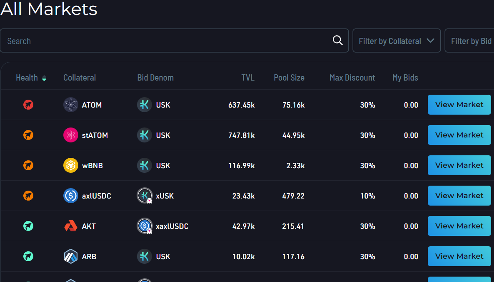

# Basics

## Overview

This section will cover various basics of navigating the ORCA user interface including basic types of ORCA markets and using Sea Shanty, a helpful tool that enhances the ORCA experience.

## ORCA Markets

There are three types of ORCA lending markets: USK backing collateral, Isolated FIN margin, and [GHOST](../../ghost-money-market/) (perpetual) liquidation markets.

All available ORCA markets can be seen on the main landing page [https://orca.kujira.app](https://orca.kujira.app).

Once cross-chain markets launch, there will be further differentiation between Kujira native and cross-chain markets. ORCA has been redesigned for the Kujira blockchain to bring decentralized community liquidations to all EVM and RUST based projects bringing accessibility and fairness for everyone. When [GHOST](../../ghost-money-market/) launched, we simplified ORCA's layout to facilitate future scalability.

<figure><figcaption></figcaption></figure>

On the landing page, each ORCA market displays information about its health, collateral type, bid denomination, total value locked, pool size, max possible discount, and total sum of your bids.

Learn more about ORCA's lending markets [here](lending-markets/).

#### SeaShanty

SeaShanty is a very helpful 3rd party tool that can be used across various Kujira decentralized applications, not only ORCA. It is recommended to interact with the Sea Shanty application on Telegram in order to download and register one's account with it. In this way, it is able to provide alerts about filled liquidation bids, filled FIN orders, USK collateral risk of liquidation, and auto-activate ORCA bids--a necessary step to be able to actually purchase liquidated collateral via ORCA at a discount. Read more [here](../../../governance/capybara-labs.md).

