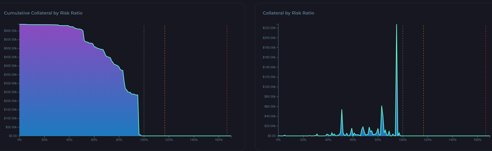

# Analytics

## Overview

ORCA liquidation analytics can help supplement user strategy as part of the ORCA bid selection process. ORCA analytics exist for each ORCA lending market. By taking a look at the amount of collateral at imminent risk of liquidation, it is possible to understand the amount of collateral that will be liquidated as long as the price of the asset being bidded on falls to a certain level.

This information can be used to predict how likely it is that a bid will fill at a certain premium level based on how much USK (or whatever other asset) is currently in the liquidation queue at lower premiums. Referring to and planning around this strategy can make all the difference between setting a large 12% bid that never gets filled and a large 7% bid that normally seems unlikely to fill, but ends up filling just a few days later when the price of (say) ATOM falls the necessary 10% to trigger the resulting liquidations up through the 7% column in the ORCA liquidation queue.&#x20;

## Types of Analytics

There are two different related charts. The right chart, the collateral by risk ratio chart shows the amount of collateral in dollars that is at a specific risk ratio. Lending markets generally function using collateral debt positions which refer to borrowing against a certain amount of collateral.

The risk ratio refers to the ratio between the amount of borrowed funds and the amount of deposited collateral divided by the maximum permitted ratio. When the value of the deposited collateral falls beyond a certain threshold, the ratio of borrowed funds to deposited collateral will surpass a maximum permitted ratio before backing collateral starts getting liquidated until the ratio is back within permitted levels. When the risk ratio exceeds 100%, backing collateral for debt positions starts liquidated.

Therefore, by understanding the total amount of collateral at certain risk ratios and looking at the amount of bids currently in the corresponding ORCA liquidation queue it is possible to plan ahead and assess the likelihood of a certain amount of funds being liquidated and the likely maximum discount that will be reached as a result of that liquidation event.

Both charts are similar, the only difference is that the left chart measures cumulative collateral by risk ratio--i.e. the total of amount of collateral that has risk ratio of at least X%. This can be used to determine the likelihood of a liquidation event of a certain magnitude and analyze how much would be liquidated in the process of backing collateral hitting a specific price level. This can also great influence ORCA bidding strategy. Here is a sample of what the ORCA analytics charts look like.

<figure><figcaption>
ATOM/USK lending market Analytics
</figcaption></figure>

Furthermore, the analytics page contains information at the bottom covering the most recent liquidations that occurred in that lending market.&#x20;

## External ORCA analytics&#x20;

On top of that, outside of the ORCA analytics page, the main lending market page contains additional information about the ratio of ORCA bids to the lending market's total locked collateral value, the lending market's total locked collateral value in USK, the total liquidation queue bid value in USK, the total amount of locked collateral (i.e. the total number of locked ATOM (LUNA/etc.) in the lending market), the user's total active bid amount in USK, the current collateral (ATOM/LUNA/etc.) price being used by the liquidation oracle, and a bar chart showing the number of times each premium column in that specific ORCA liquidation queue has been completely cleared due to a liquidation event.&#x20;
