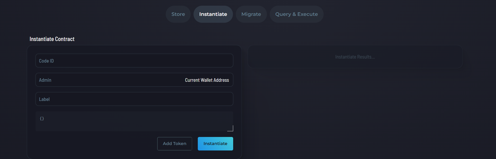

# Welcome to Kujira (Landing Page)

[Kujira.network](https://kujira.network/)

## Overview

Welcome to the Kujira blockchain. Our landing page is filled with handy links to many useful resources. It provides an essential overview of everything our ecosystem has to offer. 

<figure><figcaption>
Kujira landing page
</figcaption></figure>

## Top Tabs

The tab at the top of the page redirect you to our various products, applications, and use cases.&#x20;

### Trade Tab

<figure><figcaption>
Trade tab
</figcaption></figure>

**Spot Trading:** Kujira [FIN](fin/) is a 100% on-chain, fair matching, decentralized, permissionless, orderbook  style token exchange. [Here's how to buy KUJI on FIN](https://winkhub.app/posts/how-to-buy-kuji-on-fin).

<figure><figcaption>
Kujira FIN logo
</figcaption></figure>

**Token Swap**: You can use the [swap tab](blue/swap.md) on [BLUE](blue/) to exchange assets for[ KUJI](../tokenomics/kuji-token/) and swap between other assets for a small fee.&#x20;

<figure><figcaption>
Kujira BLUE logo
</figcaption></figure>

**Futures**: Kujira Futures is a [perpetual trading platform](https://winkhub.app/posts/perpetual-trading-coming-to-kujira-the-bullish-case-for-kuji-stakers) letting you open leveraged long and short positions with both spot and margin positions. Built on top of [FIN](fin/), it will allow you to trade perpetual contracts for almost anything, maybe even property prices.&#x20;

<figure><figcaption>
Kujira Futures logo
</figcaption></figure>

**Bots**: [Funttastic Labs](https://twitter.com/FunttasticLabs) is integrating [Hummingbot](https://twitter.com/\_hummingbot) to Kujira. This allows you to create automated trading bots which can [perform sophisticated strategies on FIN](https://winkhub.app/posts/kujira-debi-decentralised-binance#Grid-Trading).

<figure><figcaption>
Funttastic Labs logo
</figcaption></figure>

### Earn Tab

<figure><figcaption>
Earn tab
</figcaption></figure>

**Stake**: [Stake](blue/stake.md) your [KUJI](../tokenomics/kuji-token/) with (a) [validator](broken-reference)(s) to earn your share of Kujira network revenue. 98% of all revenue generated by Kujira will soon be distributed to KUJI stakers as [xKUJI](ghost-money-market/lend.md#how-does-lending-work-on-ghost) and x[USK](usk-stablecoin.md).

<figure><figcaption>
Validators are ordered from smallest to largest to promote decentralization
</figcaption></figure>

**Liquidity Pools**: By adding liquidity to specific pools on [BOW](bow/), you can earn a slice of all profits made on [FIN](fin/) from trading that pair + any extra third party [incentives](bow/product-guides/how-to-provide-incentives.md) for the pool.

<figure><figcaption>
Kujira's liquidity engine
</figcaption></figure>

### Market Tab

<figure><figcaption>
Market tab
</figcaption></figure>

**Mint USK**: You can mint USK by using your tokens as collateral. USK is the access pass to the dApp suite of the Kujira ecosystem. Learn more [here](usk-stablecoin.md).

<figure><figcaption>
Mint USK in <a href="blue/">BLUE</a>
</figcaption></figure>

**Lend & Borrow**: Kujira's Money Market, [GHOST](ghost-money-market/), connects would-be lenders and borrowers to allow you to make your assets do more. Earn interest on lent assets or enter leveraged positions by borrowing against your supplied collateral.

<figure><figcaption>
Lend your assets in <a href="ghost-money-market/">GHOST</a> to make them work for you
</figcaption></figure>

**Liquidate**: Kujira's fair liquidations engine, [ORCA](orca/), is the world's first public decentralized liquidation marketplace. Participate in Dutch auctions to purchase assets at up to a 30% (or 44%) discount (when liquidating shorts).

<figure><figcaption>
The <a href="orca/">ORCA</a> liquidation queue
</figcaption></figure>

**Fund Projects**: [PILOT](pilot-launchpad.md), is a joint project between the Kujira and [Fuzion](https://twitter.com/Fuzion\_App) teams, and functions as a unique, fair platform that allows founders to raise capital from token launches and community members to participate in token sales at ground floor valuations.&#x20;

<figure><figcaption>
The outcome of the WINK <a href="pilot-launchpad.md">PILOT</a> sale
</figcaption></figure>

### Discover Tab

<figure><figcaption>
Discover tab
</figcaption></figure>

**Ecosystem**: The Kujira ecosystem [page](https://kujira.network/ecosystem) displays a list of the various teams and integrations built on the Kujira ecosystem.

<figure><figcaption>
Kujira's premier applications
</figcaption></figure>

**Native dApps**: Discover the [building blocks](../introduction/what-is-kujira/appchain-ecosystem.md) of our composable, tight-knight DeFi powerhouse.&#x20;

<figure><figcaption>
<a href="../kujira-ecosystem/our-products.md">The Kujira product stack</a>
</figcaption></figure>

**Developers**: _Kujira is built for builders_. [Find out everything](https://kujira.network/developers) you need to know about what makes Kujira such a great place to build.&#x20;

<figure><figcaption>
Kujira's excellence at a glance
</figcaption></figure>

<figure><figcaption>
Kujira has a host of unique features
</figcaption></figure>

**Documentation**: These extensive docs you're reading right now cover pretty much everything you might want to know about Kujira. To supplement your knowledge, you can also check out [WinkHUB](../community/kujira-socials/winkhub.md) which has [Kujira Academy](https://winkhub.app/creators/kujira-academy) and the [Kujira Encyclopedia](https://winkhub.app/posts/the-kujira-encyclopedia-issue-1).&#x20;

<figure><figcaption>
Kujira's official documentation
</figcaption></figure>

## Bottom Tabs

### Links for Developers

**Getting Started**: _Kujira is built for builders_. Find out everything you need to know about what makes Kujira such a great place to build.&#x20;

<figure><figcaption>
Kujira's excellence at a glance
</figcaption></figure>

<figure><figcaption>
Kujira has a host of unique features
</figcaption></figure>

**Developer Hub**: [A hub](https://build.kujira.app/) for Kujira developer documentation. Includes essential links for getting started.

<figure><figcaption>
Kujira's developer hub
</figcaption></figure>

**Rust Documentation**: A general repository of information that applies to Rust on Kujira. Stay up to date by catching up on our documentation [here](https://docs.rs/kujira/latest/kujira/).&#x20;

<figure><figcaption>
Kujira's Rust documentation
</figcaption></figure>

**GitHub**: [Kujira's GitHub](https://github.com/Team-Kujira) contains many essential files that can help you learn about Kujira's code and how to build on top of our blockchain and product stack.&#x20;

<figure><figcaption>
Kujira's GitHUB
</figcaption></figure>

**Developer Tools**: The [developer section](blue/developer.md) on [BLUE](blue/) contains various tools that builders can delve into to enhance their experience. Store, instantiate, migrate, query & execute, etc. with your code.

<figure><figcaption>
Developer tooling on Kujira <a href="blue/">BLUE</a>
</figcaption></figure>

**Token List**: [A list of all tokens](https://finder.kujira.network/kaiyo-1/tokens) on the Kujira Network, complete with links to each token's dedicated page on [Finder](finder/), our blockchain explorer.

<figure><figcaption>
Part of Kujira's token list
</figcaption></figure>

### Links For Everyone

**Documentation**: An exhaustive ever-growing set of documentation explaining everything you might want to know about Kujira. You're reading part of our docs right now. [Here](https://docs.kujira.app/)'s the intro page.

<figure><figcaption>
<a href="https://app.gitbook.com/o/MN0hnJUd0BNCPpxWSUty/s/yPeco0BDFBM85kKY4Hkl/">Kujira empowers everyone</a>
</figcaption></figure>

**Kujira Academy**: [Kujira Academy](../help-center/kujira-academy.md) is the education hub of Kujira with its roots on [WinkHUB](../community/kujira-socials/winkhub.md). Academy combines education about various DeFi topics & an international Kujira ambassador program targeting university students as well as the general public.&#x20;

<figure><figcaption>
<a href="https://winkhub.app/creators/kujira-academy">Kujira Academy articles</a>
</figcaption></figure>

**Run a Node**: [Learn the ins and outs](../validators/run-a-node/) in Kujira's docs of how to set up and run your own [validator](broken-reference) node for the Kujira network.&#x20;

<figure><figcaption>
<a href="../validators/run-a-node/">A detailed guide on Kuijra nodes</a> 
</figcaption></figure>

**Media Assets**: Anyone can help spread the word about Kujira or build on the ecosystem with the same core design elements. [Stay in theme](https://docs.kujira.app/brand-assets/logo-options) while sharing the essence of Kujira.

<figure><figcaption>
<a href="https://docs.kujira.app/brand-assets/logo-options">Explore Kujira's media assets</a> central to the brand
</figcaption></figure>

**Blockchain Explorer**: Dive into the Kujira Network and look up information on tokens, wallets, smart contracts, and other ecosystem activity on our [Finder](finder/) application. Helpful for users and devs alike.

<figure><figcaption>
<a href="https://finder.kujira.network/kaiyo-1/contract/kujira1pw96huy6z02uk8hdpruk6g8u700dp8yxjhp46c24rwkzay2lfd3quqdum5">FIN KUJI-USDC Smart Contract</a> on <a href="https://finder.kujira.network/">FINDER</a>
</figcaption></figure>

**Privacy Policy**: [The Privacy policy](https://kujira.network/privacy-policy) explains how [Sonar](kujira-wallet/), an developed by the Kuijra team collects, uses, and protects user information. Sonar is a wallet app with native features of the Kujira blockchain.

<figure><figcaption>
Sonar App Privacy Policy
</figcaption></figure>

### General Ecosystem Links

**Native dApps**: Kujira offers a complete base layer of composable [first-party products](https://docs.kujira.app/introduction/readme/appchain-ecosystem) that allow users to participate in the decentralized financial ecosystem based on their risk appetite and desired return.

<figure><figcaption>
<a href="https://docs.kujira.app/kujira-ecosystem/our-products">A description of Kujira's 1st party products</a> with official URLs.
</figcaption></figure>

**Built on Kujira**:  The [Kujira ecosystem](../kujira-ecosystem/wider-ecosystem.md) is constantly growing. [This](https://kujira.network/ecosystem) is an overview of all the dApps, protocols, products, and services calling Kujira their home blockchain.

<figure><figcaption>
<a href="https://kujira.network/ecosystem">Some of the key teams building on Kujira</a>
</figcaption></figure>

**Sonar Mobile App**: [Your gateway to the decentralized economy](kujira-wallet/). [Access this site](https://sonar.kujira.network/) on mobile to download the iOS or Android Sonar beta.&#x20;

<figure><figcaption>
<a href="kujira-wallet/">Sonar</a> offers the premier Kujira native experience. A wallet that is more than just a wallet.
</figcaption></figure>

### Socials

#### Official Socials

**Twitter**: [Find all of our up to date official announcements](../community/kujira-socials/twitter.md) and communications on the [Kujira Twitter](https://twitter.com/TeamKujira).&#x20;

<figure><figcaption>
<a href="https://twitter.com/TeamKujira">The official Kujira Twitter account</a> is filled with tons of alpha
</figcaption></figure>

**Discord**: [Chat with our community](../community/kujira-socials/discord.md), file support tickets, check out protocols, ask dev questions to builders, participate in governance, discuss with other validators, etc. in our vibrant [Kujira Discord](https://discord.gg/teamkujira).&#x20;

<figure><figcaption>
<a href="https://discord.gg/teamkujira">Check out our bustling Kujira Discord</a>
</figcaption></figure>

**Telegram**: [The Kuijra Telegram](../community/kujira-socials/telegram.md) contains a majority of the most up to date alpha and leaks as well as a huge portion of the Kujira community and team who are always happy to chat. [Come join in!](https://t.me/team\_kujira)

<figure><figcaption>
Kujira is a family. <a href="../community/kujira-socials/telegram.md">Meet</a> other excited and passionate people on the <a href="https://t.me/team_kujira">Kujira Telegram</a>.
</figcaption></figure>

**Medium**: [Our old platform of choice](../community/kujira-socials/medium.md) for official announcements of new products, weekly write-ups, ecosystem analysis, and other team content. [WinkHUB](../community/kujira-socials/winkhub.md) is Kujira's new community content epicenter and our new home for all of the above and more.&#x20;

<figure><figcaption>
<a href="https://app.gitbook.com/s/8miqcNZ3zghCUnG2VGBE/">Kujira's old center for official written content</a>
</figcaption></figure>

#### Community Socials

**WinkHUB**: [Kujira's content epicenter](../community/kujira-socials/winkhub.md) and educational hub. Home to content (articles and videos) [by the Kujira team](https://winkhub.app/creators/dale-the-mail-whale), [Kujira Academy](https://winkhub.app/creators/kujira-academy), [protocols building on Kujira](https://winkhub.app/categories/kujira-dapps), and passionate [community members](https://winkhub.app/creators).

<figure><figcaption>
<a href="../community/kujira-socials/winkhub.md">Find detailed articles and videos about the Kujira ecosystem on WinkHUB</a>.
</figcaption></figure>

**CoinGecko**: Find basic information about the [KUJI token](../tokenomics/kuji-token/) including historical price action, statistics on its current market cap, trading volume, supply, and where you can trade it on [CoinGecko](https://www.coingecko.com/en/coins/kujira).

<figure><figcaption>
Find detailed information about the <a href="../tokenomics/kuji-token/">KUJI token</a> on <a href="https://www.coingecko.com/en/coins/kujira">CoinGecko</a>. Notice that KUJI is fully circulating and non-inflationary.
</figcaption></figure>

**YouTube**: Kujira's official [YouTube](../community/kujira-socials/youtube.md) channel. Includes some basic video tutorials.&#x20;

<figure><figcaption>
<a href="https://www.youtube.com/@TeamKujiraDeFi/featured">Kujira Official YouTube Channel</a>
</figcaption></figure>

**Reddit**: [Kujira's official community subreddit](../community/kujira-socials/reddit.md). Moderated by community volunteers.

<figure><figcaption>
<a href="../community/kujira-socials/reddit.md">Kujira's community subreddit</a>
</figcaption></figure>

**Instagram**: [Kujira's official Instagram account](../community/kujira-socials/instagram.md).

<figure><figcaption>
<a href="../community/kujira-socials/instagram.md">Kujira's official Instagram account</a>
</figcaption></figure>

## [Kujira.network](https://kujira.network/)

